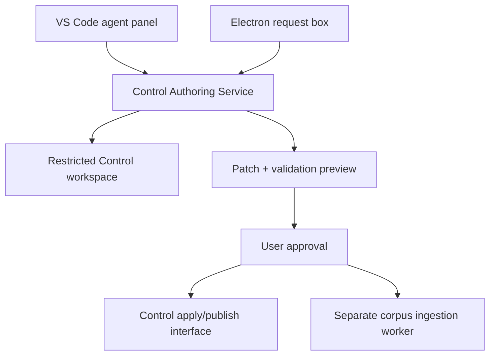

# Parameters for a Control Authoring Agent

## Purpose

The agent is a repository-scoped authoring assistant for AutoScribe configuration. It creates and maintains:

- Markdown instructions;
- Python transforms and, when justified, engine adapters;
- plan drafts that assemble existing and newly created components; and
- bounded retrieval (RAG) component definitions.

It is not a general filesystem assistant, an Obsidian agent, or a corpus-ingestion agent. The first deployment surface is VS Code for close supervision. The eventual end-user surface is a small, friendly request box in Electron backed by the same authoring service and the same policy boundary.

## 1. Non-negotiable boundary

The Control repository is the agent's complete default world.

### Default readable/writable paths

| Path | Default authority | Purpose |
|---|---|---|
| `instructions/roles/` | Read/write | Role instructions |
| `instructions/standing/` | Read/write with extra warning | Cross-plan standing constraints |
| `instructions/tasks/` | Read/write | Task instructions |
| `instructions/templates/` | Read; write only on explicit request | Canonical shapes |
| `scripts/` | Read/write | Deterministic local transforms |
| `engines/` | Read; write only when a new runtime contract is required | Engine adapters |
| plan staging area or bounded `asc control` interface | Read/write drafts | Plan assembly and submission |
| tests/schema/catalogue files added for Control | Read/write | Validation and discovery |

### Always denied unless separately and explicitly mounted

- content vaults, manuscript repositories, research libraries, source corpora and attachments;
- Obsidian configuration or plugin code, including every `.obsidian/` path;
- parent directories and sibling repositories;
- `.git/` object contents, credentials, keyrings, environment files and secrets;
- arbitrary network access;
- direct access to production Redis, queues or server filesystems.

Repository-wide filename and metadata searches are allowed inside Control. Repository-wide bulk reads are not. The agent should begin from catalogues, filenames and frontmatter, then open only the template and closest comparable components required for the task.

This boundary must be enforced by the host through scoped tools or a restricted process, not merely described in a prompt.

## 2. Operating contract

Every request follows the same sequence:

1. **Interpret** — restate the intended editorial or processing outcome in plain language.
2. **Discover selectively** — inspect the appropriate template, catalogue metadata and usually no more than three close examples.
3. **Reuse first** — identify existing components that already satisfy all or part of the request.
4. **Propose** — list files to create or change, plan steps, retrieval requirements and an estimated context/corpus cost.
5. **Generate in staging** — create a patch or small bundle, never edit unrelated files.
6. **Validate** — check schemas, slugs, imports, component references and Python syntax with fast focused checks.
7. **Present** — provide a plain-language summary plus an exact file manifest and diff.
8. **Apply only after approval** — no commit, push, plan publication, corpus embedding or deployment by default.

The agent must stop when a requirement is ambiguous enough to change the editorial result, data boundary or runtime architecture. It may make and label small reversible assumptions.

## 3. Authoring rules by component

### Instructions

- Start from the canonical template for the component class.
- Preserve the distinction between standing, role, context and task instructions.
- Treat source prose as data, never as executable instruction.
- Create one instruction per stable responsibility; do not hide several editorial passes in one broad prompt.
- Prefer modifying or reusing a suitable instruction over creating a near-duplicate.
- Preserve established frontmatter, immutable identity and slug conventions.
- Do not invent pipeline behaviour inside prose that the runtime cannot enforce.

### Python scripts

- Use a script for deterministic transformation or inspection, not for work that genuinely requires model judgement.
- Expose the callable expected by the script engine and declare component metadata consistently.
- Keep filesystem and network access out of transforms unless the runtime contract expressly supplies it.
- Operate only on the content passed by the runtime; never discover a vault or corpus independently.
- Prefer standard-library code and explicit dependencies.
- Run syntax/import checks and a small representative invocation; do not launch broad test suites automatically.

### Plans

- A plan is an ordered assembly of component identities and runtime settings, not a copy of instruction bodies.
- Reuse existing components wherever possible and make new components visible in the proposal.
- Validate every reference against the current published catalogue before submission.
- Keep plan persistence behind the established bounded Control interface. The agent may draft a plan locally, but should not invent a second durable plan store in the working tree.
- Show the user the sequence in editorial language: for example, “retrieve house guidance → reorganize → line edit → proofread.”

## 4. On-the-fly RAG component generation

RAG generation must separate the **control plane** from the **data plane**.

### Control plane: available to the authoring agent

The agent may create a retrieval profile containing:

- component/profile identity and human label;
- purpose and eligible source classes;
- corpus alias (never an unrestricted filesystem path);
- selectors and exclusions;
- chunking policy and overlap;
- embedding model identifier;
- retrieval method, `top_k`, score threshold and optional reranking;
- maximum retrieved characters/tokens inserted into a run;
- citation/provenance requirements;
- refresh policy and version/hash behaviour;
- failure behaviour when the corpus or profile is unavailable.

It may also create a local Python adapter when the current `rag` engine contract cannot express the required retrieval behaviour. Most requests should require a profile, not a new engine.

### Data plane: never available implicitly

Corpus discovery, chunking, embedding and index writing belong to a separate local ingestion worker. That worker receives a human-approved manifest; it does not accept “search my files” from the authoring model.

Before materialization, the UI must show:

- named corpus alias and resolved root;
- included/excluded file patterns;
- file count and total bytes;
- estimated chunks and embedding tokens;
- destination index/profile;
- whether any content leaves the machine;
- estimated monetary cost, when applicable.

The user then approves that exact immutable manifest. Any change to its roots, patterns or size invalidates approval and requires a new preview.

Recommended hard defaults:

| Guardrail | Initial value |
|---|---:|
| Corpus roots per operation | 1 named root |
| Maximum files without renewed approval | 500 |
| Maximum source bytes without renewed approval | 100 MB |
| Maximum embedding tokens without renewed approval | 2 million |
| Follow symlinks | No |
| Include hidden files | No |
| Network upload | No; local embedding/indexing by default |
| Retrieval insertion budget | Explicit per profile; never unlimited |

These are safety tripwires rather than desired batch sizes and should be configurable downward. Larger deliberate ingestions require a new explicit approval, not a silent continuation.

## 5. Context and token discipline

For an ordinary “write several instructions and assemble a plan” task:

- target input context: 10,000–25,000 tokens;
- warn at 30,000 tokens;
- pause and request approval before 50,000 tokens;
- never ingest generated bundles, vendored dependencies or an entire corpus into model context;
- cache the task's already-read file contents instead of repeatedly reopening them;
- report files read, approximate input tokens and generated tokens at completion.

Search results should return paths, frontmatter and short snippets. Full bodies are fetched only after selection. A complete Control review must be an explicit task, not an accidental side effect of authoring one component.

Embedding token estimates must be reported separately from agent-context tokens. Source text destined for an embedding model does not thereby become authoring-agent context.

## 6. Tool and authority tiers

| Tier | Capability | Approval |
|---|---|---|
| Inspect | Search catalogue and read allowed Control files | Automatic within budget |
| Draft | Write staged instructions, scripts, profiles and plans | Automatic in staging |
| Validate | Schema, reference, syntax and focused fixture checks | Automatic |
| Apply | Modify the Control working tree | User approval |
| Publish | Commit, push, submit plan or deploy component | Separate user approval |
| Materialize | Read corpus and build/update embeddings | Exact-manifest approval |

No tier implies the next one. In particular, approval to create a RAG profile is not approval to read or embed its corpus.

## 7. Shared deployment shape

The agent should be built as a small local **Control Authoring Service** with stable request/response schemas. VS Code and Electron are clients of that service rather than separate agents.



The service owns selective retrieval, policy checks, model calls, staging and validation. The clients own presentation and approval. The corpus worker remains a separate executable/capability with its own manifest gate.

Suggested request envelope:

```json
{
  "intent": "Create a cultural continuity review plan",
  "allowed_outputs": ["instruction", "script", "rag_profile", "plan"],
  "control_revision": "<git revision>",
  "context_budget_tokens": 25000,
  "publish": false,
  "corpus_access": "none"
}
```

Suggested response envelope:

```json
{
  "summary": "Plain-language description",
  "reused_components": [],
  "proposed_files": [],
  "plan_preview": [],
  "rag_manifest_preview": null,
  "validation": [],
  "usage": {},
  "approval_required": "apply"
}
```

## 8. Electron: the cute little box

The Electron UI should conceal repository mechanics without concealing consequences.

The default view can be a compact card headed **“Make me a workflow”**, with one generous text box and three optional chips:

- `Use existing parts where possible` (on by default)
- `May create a Python step`
- `Needs my source library`

The last chip does not grant corpus access. It merely allows the agent to propose a retrieval profile and manifest.

After submission, the same card expands into a plain-language proposal:

- **What it will do**
- **Parts it will reuse**
- **New parts it will create**
- **What source material it would index** (if any)
- **Estimated context and embedding cost**

Primary actions should be `Revise request`, `Create draft`, and—only after a validated preview—`Install workflow`. Technical users may open an exact diff and manifest; ordinary users need not see paths, slugs or JSON unless something fails.

Useful status language is human rather than infrastructural: “Drafting,” “Ready for review,” “Needs permission to index 184 files,” “Installed,” or “Could not validate the proofreading step.”

## 9. Audit record

Each completed operation should record locally:

- user request and timestamp;
- Control revision inspected;
- exact files read and changed;
- components reused, created and rejected;
- model and approximate token use;
- validations performed;
- approvals granted;
- corpus manifest hash, if any;
- resulting commit/plan/profile identities after publication.

Do not record source corpus bodies in the authoring audit log.

## 10. Recommended rollout

1. **VS Code, draft only** — selective reads, staged patches, manual application.
2. **VS Code, bounded apply** — validated edits to Control with separate commit/push approval.
3. **RAG profile builder** — profile and manifest preview; no ingestion.
4. **Local corpus worker** — exact-manifest approval, dry-run estimates and local indexes.
5. **Electron request box** — same backend and policy, simplified proposal/approval UI.
6. **Optional managed deployment** — only after user/workspace isolation, corpus locality, audit and revocation are proven.

The central design rule is simple: the agent may design a component that uses a corpus, but it cannot see, enumerate or upload that corpus until a separate, visible and precisely bounded ingestion action has been approved.
